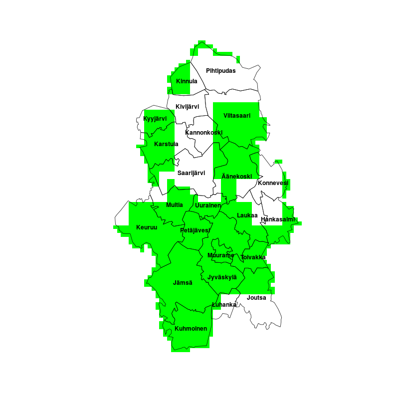
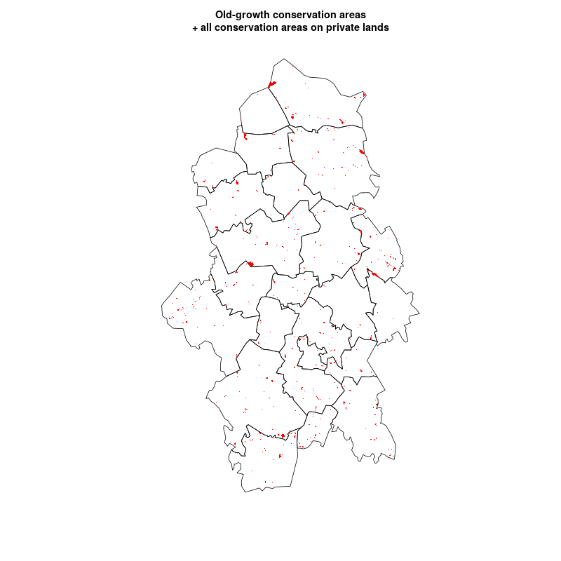

# Materials for the Biodiversity Map Hackathon November 28–29th

This repository holds files and metadata for the biodiversity map hackathon to be held in November 2015. Biodiversity map is a project of Open Knowledge Foundation Finland (OKFFI) that uses open data to help solve forest conflicts and predict the locations of potential nature conservation areas.

In the pilot phase of this project we're interested in predicting the locations of potential nature conservation areas in Central Finland using open LiDAR ( or laser scanning) data produced by the National Land Survey of Finland.

The Lidar files and derived forest structure rasters would take too much space to host on Github, so they'll stay on CSC's virtual machine for now. Instead this repository holds three example rasters derived from one lidar file.

## Data Description

### Forest Structure Rasters

We have ~1500 laser scanning files from Central Finland, each spanning a 3 km x 3 km area. From each of these files, 3 rasters are generated:
- Canopy cover index (Non-ground LiDAR returns / all returns), 6 m resolution.
- Maximum tree height, 6 m resolution
- Mean lidar return intensity, 2 m resolution

These measures have been shown to be good predictors of tree density and forest basal area in boreal coniferous forests ([article](http://digitalcommons.unl.edu/cgi/viewcontent.cgi?article=1183&context=usdafsfacpub)).

An example dataset derived from one lidar file is included in `rasteritulokset/`.

The areas of Central Finland for which we have data are shown in green in the next image: 

These "forest structure rasters" are also calculated on buildings, roads etc, clip these out before doing any analyses.

### Nature reserves

We have 4 shapefiles describing different kinds of nature reserves from Central Finland. They are all located in `nature_reserve/`.
**NatureReserveOldgrowthProgrammePrivate** has conservation areas founded on privately owned lands that are part of the Programme for the Protection of Old-Growth Forests (http://www.ym.fi/en-us/Nature/Biodiversity/Nature_conservation_programmes)
**NatureReserveOldgrowthProgrammeState** is the same as above, but on state-owned lands
**NatureReserveOldgrowthState** has nature reserves that are classified as old-growth forests, but are not part of any conservation programme
**NatureReservePrivate** has all privately owned conservation areas.

The shapefiles have considerable overlap, as a piece of land can be protected on several grounds.

Notice that `NatureReservePrivate.shp` holds all nature reserves on private land, not just those that have old-growth forests. This is a problem, since most of our nature reserves are in this file.

In addition to spatial data, we also have a spreadsheet describing nature reserves from the Forest Biodiversity Programme METSO that have been marked to at least partially consist of forests with lots of deadwood (`nature_reserve/meta/runsaslahopuustoset_ysat.csv`). It would be very valuable for refining our analyses to combine the data from `NatureReservePrivate.shp` and `runsaslahopuustoset_ysat.csv`.

Here is a map showing the reserves' locations in Central Finland:

### Forest Mask

This file is to big to host on Github. It can be [downloaded from Dropbox](https://www.dropbox.com/s/37u4g3jg6frqjdn/forest_mask.zip?dl=0) instead.

The `forest_mask.zip` contains a shapefile describing the area in Central Finland that is in forestry use. The field "omistajary" in its attribute table apparently tells whether a forest patch is private or public property: a value of 0 when public property, 1 otherwise.

### Protection Suggestion

`protection_suggestion/protection_suggestion` is a digitized suggestion for a nature reserve in the Keuruu forest conflict area made by the Finnish Association for Nature Conservation bases on their field studies. The field "type" in its attribute table tells whether FANC thinks an area is very valuable conservation-wise, or whether it should be conserved as otherwise valuable old-growth forest.

### Municipalities

`kuntajako/kunnat.shp` is a shapefile describing the municipalities of Central Finland.

### Map Sheet Division

`lehtijako/utm5` is a vector file describing the UTM5 map sheet division. NLS' LiDAR data is divided into UTM5 map sheets, so this file also reveals the physical location of each LiDAR file.

### List of LiDAR Files

`lasertiedostot.txt` is a text file listing all LiDAR files available from Central Finland.

### Scripts

`grass_lidarmuuttujat.sh` is the script we're using to convert laser scanning data into forest structure rasters. It's supposed to be ran in a GRASS 7 session.

`vanhan_metsan_suojelualueet.R` is an example script showing how to load and plot shapefiles in R.

### Copyright and Licences

The data and code in this repository are released under the following licences:

Laser scanning data, map sheet divisiom and municipality border shapefiles are from the National Land Survey of Finland, and released under [CC-BY 4.0](http://creativecommons.org/licenses/by/4.0/).

Nature reserve shapefiles are from the Finnish Environment Institute (SYKE), and released under [this ambiguous licence](http://metatieto.ymparisto.fi:8080/geoportal/catalog/search/resource/details.page?uuid={C305FA65-F319-4FA0-AAB8-F92AE32B6EE2}) (in Finnish). TL;DR you can share the data - but must aknowledge SYKE and mention the date the data was downloaded on. Which for these files is 9/2015.

The forest mask layer is an unlicenced free file downloadable from [their site.](http://metsakeskus.fi/metsamaski)

The suggestion for protected areas is digitized from a pdf from [this press release](http://www.sll.fi/ajankohtaista/tiedotteet/2015/metso-ohjelmaa-toteutetaan-tehottomasti-metsahallitus-hakkaa-metso-kelpoista-valtionmaata-nyt-keuruulla) of FANC.

Other content in this repository is still unlicenced.
